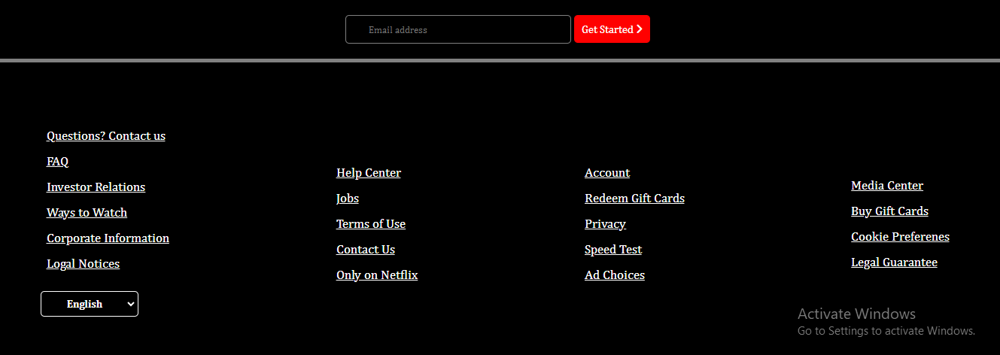

# GITHUB INDICATORS

     

# Netflix

Hello, I created  Netflix sign up page. I used here html, css and sass tags.

## ## RULES OF USE

> *STEP-1:* `https://github.com/Faatiimae/Netflix.git`  
> *STEP-2:*  enter the `Netflix` folder that appears  
> *STEP-3:*  open the folder you are in a text editor  
> *STEP-4:*  run the  all the`index.html` files in the main folder  
> *STEP-5:*  to download the project as `.zip`  [here](https://github.com/Faatiimae/Netflix/archive/refs/heads/master.zip) click  

## Technology

This project was developed using the following technologies

| No | Technique | Purpose |
| - | ---------- | --------------------- |
| 1 | HTML | Building a project skeleton |
| 2 | SASS/SCSS |  Make-up of the established skeleton | 
| 3 | GIT | Project version control management |
| 4 | VSCode | Text editor used in the project  |
 

 

